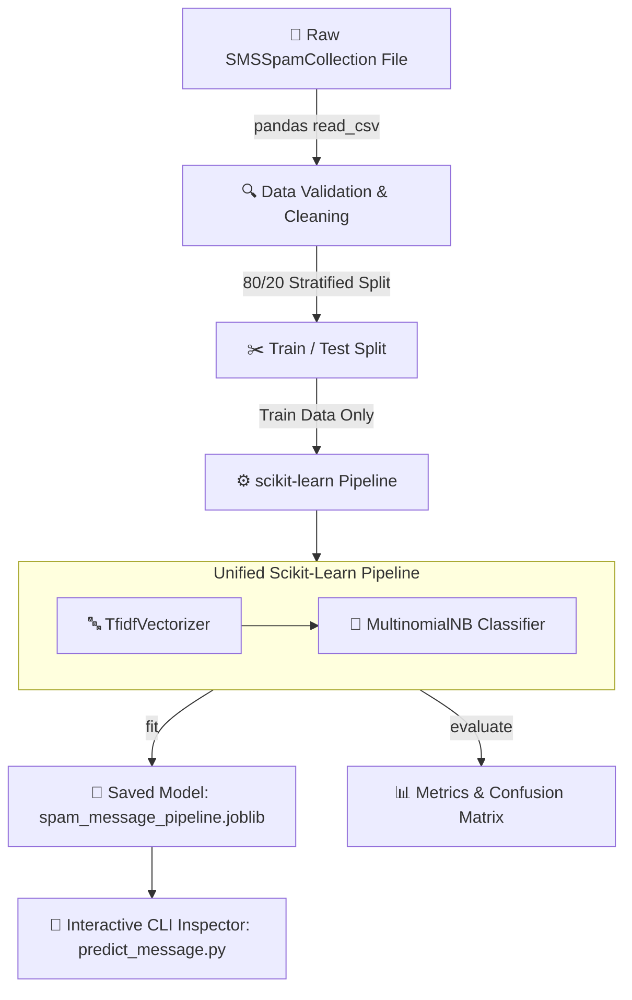

<div align="center">

# 🏴‍☠️ Grand Line Message Bounty Detector
### *SMS Spam Message Classifier*

[](https://www.python.org/)
[](https://scikit-learn.org/)
[](https://pandas.pydata.org/)
[](LICENSE)

*An approachable, beginner-friendly Natural Language Processing (NLP) machine learning application that detects spam messages using **scikit-learn**, **TF-IDF Vectorization**, and **Multinomial Naive Bayes**.*

*Featuring a light, presentation-friendly **One Piece** anime theme designed for AI Internship Portfolios.*

</div>

---

## 📌 Table of Contents
- [📖 Project Overview](#-project-overview)
- [📘 Detailed Step-by-Step User Guide (USAGE_GUIDE.md)](USAGE_GUIDE.md)
- [⚠️ Important Scope Clarification](#️-important-scope-clarification)
- [✨ Key Features](#-key-features)
- [🏗️ System Architecture](#️-system-architecture)
- [📁 Project Structure](#-project-structure)
- [📊 Dataset & Data Schema](#-dataset--data-schema)
- [🚀 Quick Start (Windows PowerShell)](#-quick-start-windows-powershell)
- [📈 Benchmark Results](#-benchmark-results)
- [💻 Interactive Inspector CLI](#-interactive-inspector-cli)
- [🏴‍☠️ One Piece Theme Note](#-one-piece-theme-note)
- [🚧 Limitations & Future Roadmap](#-limitations--future-roadmap)
- [📜 Licensing & Credits](#-licensing--credits)

---

## 📖 Project Overview

The **Grand Line Message Bounty Detector** is a binary text classification system. It analyzes short incoming text strings and categorizes them into two primary classes:

* **`ham` (Crew Message):** Legitimate, safe, and personal communication.
* **`spam` (Marine Alert):** Unwanted, promotional, or fraudulent scam messages.

The system builds an end-to-end scikit-learn `Pipeline` that couples **Term Frequency-Inverse Document Frequency (`TfidfVectorizer`)** feature extraction with a probabilistic **Multinomial Naive Bayes (`MultinomialNB`)** classifier.

---

## ⚠️ Important Scope Clarification

> [!NOTE]
> **SMS vs. Email Classification Scope**
> * **Dataset Context:** The underlying benchmark dataset used is the **UCI SMS Spam Collection**, which consists of short SMS text messages. This system is technically an **SMS Spam Message Classifier**.
> * **Email Security Systems:** Full production email security suites analyze MIME headers (`From:`, `Subject:`, `DKIM-Signature`), HTML layout tags, hyperlinked domains, network routing paths, and attachments. Plain SMS text messages lack these structural elements.
> * **Internship Alignment:** The internship assignment is titled *"Spam Email Classifier"*. This project builds the core Natural Language Processing engine responsible for text body intent classification.

---

## ✨ Key Features

* 🛡️ **Leakage-Free ML Pipeline:** Fits text vectorization vocabulary exclusively on training data inside a scikit-learn `Pipeline`.
* ⚡ **TF-IDF Feature Weighting:** Employs sublinear term frequency scaling (`sublinear_tf=True`) and Unicode accent normalization to highlight spam signals.
* 📊 **Stratified Data Splitting:** Implements an 80/20 train/test split (`random_state=42`) with label stratification to maintain exact class proportions.
* 🎯 **Strict Precision Optimization:** Achieves 100% precision on the evaluated test set, minimizing false positive risks.
* 💾 **Model Persistence:** Serializes the trained pipeline object into `models/spam_message_pipeline.joblib` for instant real-time inference.
* 🐚 **Interactive Terminal Inspector:** Includes an interactive command-line interface for real-time text evaluation with estimated class probabilities.

---

## 🏗️ System Architecture



---

## 📁 Project Structure

```text
Project-1-Spam-Email-Classifier/
├── 📂 data/
│   ├── SMSSpamCollection           # Downloaded raw dataset file (Git-ignored)
│   └── README.md                   # Dataset details & manual setup steps
├── 📂 models/
│   ├── .gitkeep                    # Directory structure tracking
│   └── spam_message_pipeline.joblib # Trained pipeline artifact (Git-ignored)
├── 📂 reports/
│   └── project_report.md           # Formal 30-section technical report
├── 📂 src/
│   ├── train_model.py              # Loads data, trains pipeline, evaluates, & saves model
│   └── predict_message.py          # Interactive terminal prediction CLI
├── .gitignore                      # Environment & model exclusion rules
├── README.md                       # Main project documentation (this file)
└── requirements.txt                # Lightweight project dependencies
```

---

## 📊 Dataset & Data Schema

* **Source:** [UCI Machine Learning Repository — SMS Spam Collection](https://archive.ics.uci.edu/ml/datasets/SMS+Spam+Collection)
* **Authors:** Tiago A. Almeida and José María Gómez Hidalgo.
* **Physical Lines vs. Parsed Records:**
  * The downloaded source file contains **5,574 physical lines**.
  * After parsing expected tab-separated `label` and `message` fields, the script loaded **5,572 valid records**: **4,825 `ham` (86.59%)** and **747 `spam` (13.41%)**.
  * All metrics are computed against these 5,572 parsed records.

### Data Schema Table

| Column Name | Data Type | Allowed Values | Description |
|---|---|---|---|
| `label` | String | `ham`, `spam` | Target label (`ham` = legitimate, `spam` = fraudulent) |
| `message` | String | Free-text string | Raw plain-text message string |

---

## 🚀 Quick Start (Windows PowerShell)

### Step 1: Set Up Environment

Open Windows PowerShell in the project directory:

```powershell
# Create virtual environment
python -m venv .venv

# Activate environment (Windows)
.venv\Scripts\Activate.ps1

# Install required dependencies
pip install -r requirements.txt
```

### Step 2: Download Dataset

1. Download the official zip archive: [UCI SMS Spam Collection Zip](https://archive.ics.uci.edu/static/public/228/sms+spam+collection.zip)
2. Extract the file `SMSSpamCollection` (without extension) into the `data/` folder:
   `data/SMSSpamCollection`

### Step 3: Train the Model

Train the TF-IDF + Naive Bayes pipeline, display metrics, and generate the model artifact:

```powershell
python src/train_model.py
```

### Step 4: Run Interactive Prediction Inspector

Launch the terminal inspector to scan custom messages in real time:

```powershell
python src/predict_message.py
```

---

## 📈 Benchmark Results

Evaluated on **1,115 unseen test messages** (20% split, `random_state=42`):

| Evaluation Metric | Measured Score | Percentage | Notes |
|---|---:|---:|---|
| **Accuracy** | `0.9596` | **95.96%** | Overall correct predictions |
| **Spam Precision** | `1.0000` | **100.00%** | Zero false alarms on test split |
| **Spam Recall** | `0.6980` | **69.80%** | Spam catch rate |
| **Spam F1-Score** | `0.8221` | **82.21%** | Harmonic mean of precision & recall |

### Confusion Matrix Breakdown

```text
                 Predicted 'ham'   Predicted 'spam'
Actual 'ham'  :       966             0
Actual 'spam' :       45              104
```

> [!IMPORTANT]
> **Precision & False Positives Interpretation:**
> Zero false positives (`FP = 0`) were observed on this specific test set split, yielding 100.00% precision. This result applies strictly to the evaluated test split and does not guarantee zero false positives on future unseen data.

---

## 💻 Interactive Inspector CLI

When executing `python src/predict_message.py`, the CLI provides real-time model probability estimates:

```text
=================================================================
      GRAND LINE MESSAGE BOUNTY DETECTOR — INSPECTOR CLI     
=================================================================
 Welcome, Navigator! Enter any message to check for pirate spam.
 Type 'exit', 'quit', or 'q' to end session.
=================================================================

GrandLine-Inspector> URGENT! You have won 1,000,000 Berries! Call 09061701461 now to claim.
-----------------------------------------------------------------
 Result             : [MARINE ALERT] Classified as 'spam'
 Estimated Probability: 91.76%
-----------------------------------------------------------------
```

### Sample Test Prompts

1. **Personal Communication (`ham`):**
   > *"Hey Luffy, we are meeting at the Sunny deck for lunch at 12:30."*
2. **Promotional Scam (`spam`):**
   > *"URGENT! You have won a FREE camera phone! Call 09061701461 right now to claim your prize."*
3. **One Piece Themed Test Message:**
   > *"SECRET MARINE ALERT: Click here to report Straw Hat Luffy for 3,000,000,000 Berries cash transfer."*

---

## 🏴‍☠️ One Piece Theme Note

This project incorporates a subtle, presentation-friendly **One Piece** anime theme (`Grand Line Marine Intelligence`, `Crew Message`, `Marine Alert`) in CLI log headers and documentation. This presentation styling is strictly for visual motivation and portfolio engagement; it does not alter standard machine learning algorithms or statistical methodologies.

---

## 🚧 Limitations & Future Roadmap

### Current Limitations
- **Plain-Text Scope:** Evaluates text strings without parsing email headers or HTML content.
- **Vocabulary Bounds:** Optimized for English language vocabulary patterns.
- **Temporal Context:** Derived from mid-2000s SMS spam text distributions.

### Future Roadmap
- [ ] Support email corpora (Enron Spam & SpamAssassin datasets).
- [ ] Add n-gram word features (`ngram_range=(1, 2)`).
- [ ] Implement Logistic Regression and SVM classifier comparisons.
- [ ] Add an explicit error-analysis tool to output false negative text strings.

---

## 📜 Licensing & Credits

* **Dataset Credit:** UCI SMS Spam Collection created by Tiago A. Almeida and José María Gómez Hidalgo. Hosted on [UCI Machine Learning Repository](https://archive.ics.uci.edu/ml/datasets/SMS+Spam+Collection).
* **Project Code:** Created as part of an Artificial Intelligence Internship Project under MIT License.
